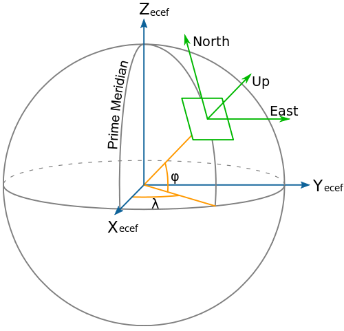
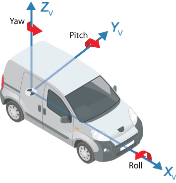
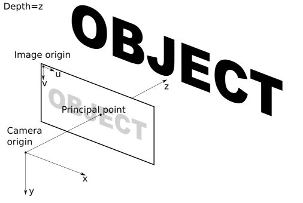

.. _conventions: 

Conventions
===========

Coordinate systems and transformations
--------------------------------------
There are several coordinate systems that are used in this system, by default we use the following conventions. 
All data should be saved/exported in the correct format, if some modules use a different convention internally,
the conversion should be done within the module, and output data should be converted back to this convention.

**Transformations between the coordinate systems**

All the transformations are saved in the form of ``SE3`` matrices,
where the top left 3x3 elements represent the rotation matrix ``R`` and the first three rows of the last column denote the translation ``t`` in meters.
They are saved using the convention ``T_a_b``, which denotes the transformation matrix that transforms the points from the coordinate system ``a``
to the coordinate system ``b``. For example a point :math:`\mathbf{p}_a` in coordinate system ``a`` can be transformed to point :math:`\mathbf{p}_b` as

.. math::
    \mathbf{p}_b = \mathbf{R}_a^b * \mathbf{p}_a + \mathbf{t}_a^b

**Global coordinate frame**

The position and orientation of the ego car, as well as other objects in the scene, are expressed in the earth-centered-earth-fixed (ECEF) coordinate system in the form of SE3 matrices. 
To avoid very large coordinates, we set the first pose of the ego car in the sequence to an identity matrix and express all other poses relative to it.
This reference pose is available as ``T_rig_world_base`` [#f1]_

**Rig coordinate frame**

The ``rig`` coordinate system is defined as a right-handed coordinate system with the x-axis pointing to the front of the car, y is pointing left, and z up.
The origin of the coordinate system is located in the middle of the rear axis on the nominal ground.
All poses of the ego car are always expressed as ``T_rig_world`` transformations with associated timestamps (e.g., the start- and end-poses corresponding to a lidar spin).

**Camera and image coordinate system**

Both camera and image coordinate systems are right-handed coordinate systems.
The axes of the camera coordinate system are defined as follows, the camera looks down the +z axis, the x-axis points to the right, and the y-axis points down.
The origin is at the optical center of the camera.
The image coordinate system is defined such that the u-axis points to the right and the v-axis down.
The origin of the image coordinate system is in the top left corner of the image, and the units are pixels.

Folder structure
----------------

The data pre-processed using DSAI on Maglev will be made available in the following folder structure [#f2]_:

.. code-block:: text

   session-id/
    ├-lidars/
    │ ├─lidar_gt_top_p128_v4p5/
    │ │ ├-000000.hdf5
    │ │ ├-000000.json
    │ │ ├-000001.hdf5
    │ │ ├-000001.json
    │ │ ├─...
    │ │ └-meta.json
    │ │
    │ ├─{lidar_parking_gt_front_p128/}
    │ │ ├-000000.hdf5
    │ │ ├-000000.json
    │ │ ├─...
    │ │ └-meta.json
    │ │
    │ └─...
    │
    ├-cameras/
    │ ├─camera_front_wide_120fov/
    │ │ ├-000000.jpeg
    │ │ ├-000000.json
    │ │ ├-{000000_sem.png}
    │ │ ├-{000000_inst.hdf5}
    │ │ ├─...
    | | ├-mask.png
    │ │ └-meta.json
    │ │
    │ ├─camera_front_fisheye_200fov/
    │ │ ├-000000.jpeg
    │ │ ├-000000.json
    │ │ ├-{000000_sem.png}
    │ │ ├-{000000_inst.hdf5}
    │ │ ├─...
    | | ├-mask.png
    │ │ └-meta.json
    │ │
    │ └─...
    │
    ├-{radars/}
    │ ├─radar_front_center/
    │ │ ├-000000.hdf5
    │ │ ├-000000.json
    │ │ ├─...
    │ │ └-meta.json
    │ │
    │ ├─radar_front_left/
    │ │ ├-000000.hdf5
    │ │ ├-000000.json
    │ │ ├─...
    │ │ └-meta.json
    │ │
    │ └─...
    │
    ├-poses.hdf5
    ├-labels.json
    └-meta.json

Sensor Data
-----------

**Images**

Camera-associated image data is saved either in the `*.jpeg` (raw sensor data), in the `*.png` (masks / semantic segmentations), or the `*.hdf5` format (instance segmentations), respectively.

**Point clouds**

Lidar and radar point clouds are saved in the `*.hdf5` files, in the tabular format with named columns.

Lidar data contains the following columns:

* ``xyz_s`` - 3D coordinate of the *start* of the ray in the sensor's end-of-spin reference frame (float32, [n,3])
* ``xyz_e`` - Motion-compensated 3D coordinate of the *end* of the ray in the sensor's end-of-spin reference frame (float32, [n,3])
* ``intensity`` - measured intensity (float32, [n])
* ``dynamic_flag`` - dynamic flag (int8, [n]): ``-1`` if not evaluated, ``0`` for static points, and ``1`` for dynamic points
* ``timestamp_us`` - point timestamp in microseconds (uint64, [n])

Radar data contains the following columns:

* ``xyz_s`` - 3D coordinate of the start of the ray in the sensor's end-of-frame reference frame (float32, [n,3])
* ``xyz_e`` - 3D coordinate of the end of the ray in the sensor's end-of-frame reference frame (float32, [n,3])
* ``azimuth`` - azimuth angle in sensor frame (float32, [n]) 
* ``elevation`` - elevation angle in sensor frame (float32, [n])
* ``radial-velocity`` - radial-velocity relative to sensor frame (float32, [n])
* ``doppler-ambiguity`` - Doppler-ambiguity of measurement (float32, [n])
* ``rcs`` - Radar-cross-section of measurement (float32, [n])
* ``timestamp_us`` - point timestamp in microseconds (uint64, [n])

**Metadata**

Metadata is available per frame, but also for individual sensors and for the general sequence. They are all stored in form of ``*.json`` files.

Per-frame metadata contains the following entries for all sensors:

* ``timestamps_us`` - timestamps of the frame's start and end point in microseconds (uint64, [2,])
* ``T_rig_worlds`` - SE3 transformation matrices from the rig to the world coordinate system at the start and end timestamp of the frame (float32, [2,4,4] )

For individual sensors we also save session-wise metadata:

*All Sensors*:

* ``T_sensor_rig``- SE3 transformation matrix from the sensor to the rig coordinate system (float32, [4,4])
* ``frame_timestamps_us`` - end-of-frame timestamps of the all sensor frames in microseconds (uint64, [n,])

*Cameras*: 

* ``camera_model_type`` - camera model type (str, one of [ftheta, pinhole])

The field ``camera_model`` will unconditionally contain:

* ``resolution`` - width and height of the image in pixels (uint32, [2,])
* ``exposure_time_us`` - exposure time of the camera in microseconds (uint64)
* ``rolling_shutter_direction`` - direction of the rolling shutter (str, one of [TOP_TO_BOTTOM, LEFT_TO_RIGHT, BOTTOM_TO_TOP, RIGHT_TO_LEFT])

If ``camera_model_type = 'f_theta'`` the following intrinsic parameters will additionally be available in ``camera_model``:

* ``principal_point`` - u and v coordinate of the principal point (float32, [2,])
* ``bw_poly`` - coefficients of the backward distortion polynomial (float32, [6,])
* ``fw_poly`` - coefficients of the forward distortion polynomial (float32, [6,])

If ``camera_model` = 'pinhole'`` the following intrinsic parameters will additionally be available in ``camera_model``:

* ``principal_point`` - u and v coordinate of the principal point (float32, [2,])
* ``focal_length_u`` / ``focal_length_v`` - focal length in u and v direction, resp. (float32)
* ``p1``, ``p2``, ``k1``, ``k2``, ``k3`` - distortion coefficients (float32)

*Lidars*: 

* ``{sampling_pattern}`` - sampling pattern of the lidar sensor in terms of elevation and azimuth angles (float32, [n,m])

Finally, we also save general metadata related to the session (input data and versioning):

* ``version`` - version of the dataset (str)
* ``egomotion_type`` - type of ego-motion that was used to generate the data (str) 
* ``calibration_type`` - type of sensor calibration that was used to generate the data (str)
* ``sensors`` - individual lists of ``cameras`` / ``lidars`` / ``radars`` sensor names processed available in the data (str)

Labels
------

**4D autolabels**

Annotation data is stored in a segmented format: 

* all observations of each unique track instance is stored in a session-wide format in the root's `labels.json` file by references to the sensor's frame observing the track's instance
* individual time-associated instances of each track observation (e.g., 3D bounding boxes in lidar frames or 2D bounding boxes in camera frames) are stored in the per-frame meta data of each sensor's frame

.. rubric:: Footnotes

.. [#f1] The ``T_rig_world_base`` of the Maglev processed datasets will by default be an identity matrix if DeepMap poses are not used. The coordinate system is hence a local 3D cartesian system and not ECEF.
.. [#f2] Curly brackets denote optional data.
